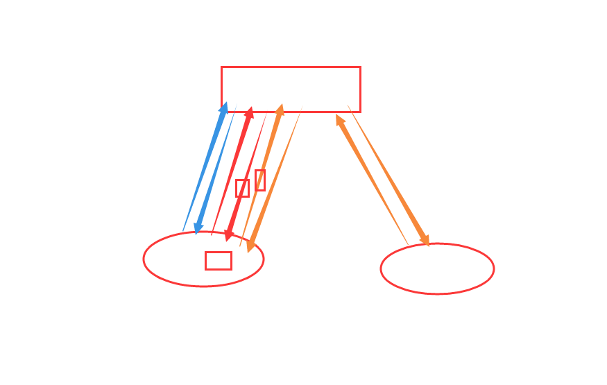

## 今日内容

### cookie

https://www.cnblogs.com/maple-shaw/articles/9502602.html

#### 定义

保存在浏览器本地上一组组键值对

count : 0 

#### 特点

1. 由服务器让浏览器进行设置的
2. 浏览器保存在浏览器本地
3. 下次访问时自动携带

#### 应用

1. 登录
2. 保存浏览习惯
3. 简单的投票



#### django中操作cookie

##### 设置：

ret = reditrect('index')

ret.set_cookie(key,value)   #    set-cookie:  key=value

ret.set_signed_cookie('is_login', '1', 's21')  # Set-Cookie: is_login=1; Path=/

##### 获取：

request.COOKIES   {}     []    get

is_login = request.get_signed_cookie('is_login', salt='s21', default='')

##### 删除：

```
ret = redirect('/login/')
ret.delete_cookie('is_login')
```

### session

#### 定义

保存在服务器上一组组键值对(必须依赖cookie)

#### 为什么要有session？

1.cookie保存在浏览器本地

2.大小个数受到限制

#### django中操作session

```python
request.session[key]  = value

request.session[key]    request.session.get(key)

# 将所有Session失效日期小于当前日期的数据删除
request.session.clear_expired()

# 检查会话session的key在数据库中是否存在
request.session.exists("session_key")

# 删除当前会话的所有Session数据
request.session.delete()
　　
# 删除当前的会话数据并删除会话的Cookie。
request.session.flush() 
    这用于确保前面的会话数据不可以再次被用户的浏览器访问
    例如，django.contrib.auth.logout() 函数中就会调用它。

# 设置会话Session和Cookie的超时时间
request.session.set_expiry(value)
```

#### session的配置

见默认配置

全局配置

from django.conf import global_settings

