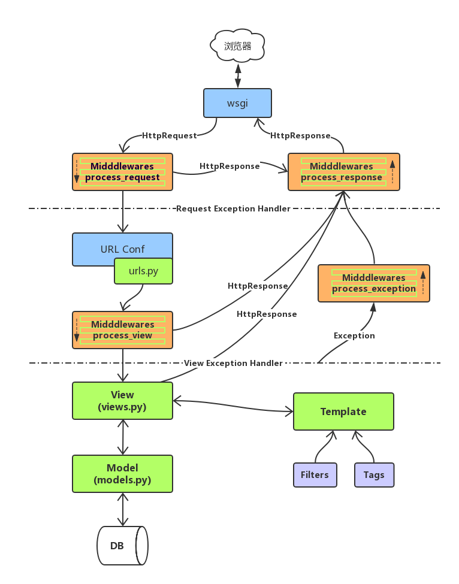

## django

### 内容回顾

web框架    socket服务端

#### http协议

请求的格式

“请求方式 URL路径 协议版本HTTP/1.1\r\n

k1:v1\r\n

k1v2\r\n

\r\n

请求体（请求的数据）”

响应的格式

“HTTP/1.1 状态码 状态描述\r\n

k1:v1\r\n

k1v2\r\n

\r\n

响应体（HTML页面）”

头

contentType：  text/html    application/json 

set-cookie   cookie  

Location  

MVC   MTV  

#### 路由    

 url  和 函数的对应关系

​	url（正则表达式，视图，{} ，name）

分组和命名分组

路由分发  include

url的命名和反向解析

namespace  

视图   CBV   FBV 

request

response

### ORM

### 模板

### cookie session

### ajax

### form

## 今日内容

### 中间件

<https://www.cnblogs.com/maple-shaw/articles/9333824.html>

中间件是处理django的请求和响应的框架级别的钩子，本质上就是一个类。

中间件可以定义五个方法:

- process_request(self,request)
- process_view(self, request, view_func, view_args, view_kwargs)
- process_template_response(self,request,response)
- process_exception(self, request, exception)
- process_response(self, request, response)

 4个特征：  执行时间、执行顺序、参数、返回值

#### process_request(self,request)

执行时间：视图函数之前

参数：request   —— 》 和视图函数中是同一个request对象

执行顺序：按照注册的顺序  顺序执行

返回值：

​		None ： 正常流程

​		HttpResponse： 后面的中间的process_request、视图函数都不执行，直接执行当前中间件中的process_response方法，倒叙执行之前的中间中process_response方法。

#### process_response(self, request, response)

执行时间：视图函数之后

参数：

​	request   —— 》 和视图函数中是同一个request对象

​	response   ——》  返回给浏览器响应对象

执行顺序：按照注册的顺序  倒叙执行

返回值：

​		HttpResponse：必须返回response对象

#### process_view(self, request, view_func, view_args, view_kwargs)

执行时间：视图函数之前，process_request之后

参数：

​		request   —— 》 和视图函数中是同一个request对象

​		view_func  ——》 视图函数

​		view_args   ——》 视图函数的位置参数

​		view_kwargs  ——》 视图函数的关键字参数

执行顺序：按照注册的顺序  顺序执行

返回值：

​		None ： 正常流程

​		HttpResponse： 后面的中间的process_view、视图函数都不执行，直接执行最后一个中间件中的process_response方法，倒叙执行之前的中间中process_response方法。

#### process_exception(self, request, exception)

执行时间（触发条件）：视图层面有错时才执行

参数：

​		request   —— 》 和视图函数中是同一个request对象

​		exception   ——》 错误对象

执行顺序：按照注册的顺序  倒叙执行

返回值：

​		None ： 交给下一个中间件取处理异常，都没有处理交由django处理异常

​		HttpResponse： 后面的中间的process_exception不执行，直接执行最后一个中间件中的process_response方法，倒叙执行之前的中间中process_response方法。

#### process_template_response(self,request,response)

执行时间（触发条件）：视图返回的是一个templateResponse对象

参数：

​	request   —— 》 和视图函数中是同一个request对象

​	response   ——》  templateResponse对象

执行顺序：按照注册的顺序  倒叙执行

返回值：

​		HttpResponse：必须返回response对象

### django请求的生命周期

