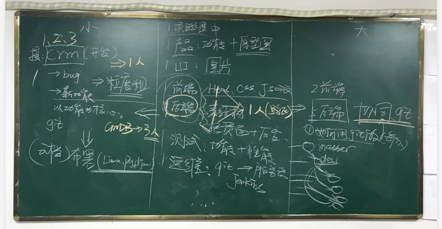

## day116

### 第一天

- 重要基础
- 企业开发流程

作业：面试题锦集写到17页。

### 第二天

- 面试题讲解

作业：面试题锦集写到35页。


## 今日内容

### 一.知识点回顾

1. Python和其他语言的对比?

   ```
   C语言，更偏先底层的语言/自己代码实现内存管理/性能非常好/系统底层。
   PHP，在web开发方面比较厉害。
   Java，各方面都有广泛应用，企业级应用。
   C#，由于和windonws server的绑定关系，逐渐没落。
   Python，从诞生开始就自然生长，在各领域积累大量类库：web/爬虫/数据分析/机器学习/人工智能。
   Golang，docker，并发性能。
   
   C语言和java在大学都学，基本上都忘记了。
   主要写的是Python/正在 自学 Go？
   ```

2. 你们公司用的Python2还是Python3？

   ```
   很多Python2
   新项目Python3
   ```

3. python2和python3的区别？

   ```
   默认解释器编码：py2，ascii；python3，utf-8;
   字符串和字节相关：
   			py2:    unicode          str(utf-8,gbk)    
               py3:    str              bytes(utf-8,gbk)   
   经典类和新式类：
   			py2,经典类和新式类
   			py3,新式类（默认继承object）
   			
   字典的keys和values：
   			py2：.keys() 获取到的是列表
   			py3：迭代器
   
   yield from:
   			py2:没有
   			py3：有
   			
   线程池和进程池：
   			py2：有进程池/没有线程池
   				from multiprocessing import Pool
   			py3：有进程池/有线程池
   				from concurrent.futures.thread import ThreadPoolExecutor
   				from concurrent.futures.process import ProcessPoolExecutor
   xrang/range
   input
   int/long
   ```

4. 列举常见数据类型中的方法。

   ```
   str: strip/split/replace/join/format
   list:append/pop/insert
   ```

5. 集合求交集/并集/差集

   ```
   有两种方式：
   	方法
   	运算符
   ```

6. 运算符

   ```
   1 and 2 or 6 or 9 and 7 
   ```

7. 深浅拷贝的区别？

   ```
   可变类型
   一层和多层的区别？
   ```

8. pass的作用？

9. *args和**kwargs的作用？

10. 对于函数的参数传递的是：值？引用？

11. def func(a,b=[]): pass 有什么坑？

    ```
    如果调用函数时，不对b进行赋值，那么b就是在创建函数之处函数内部创建的一个空列表。只要不传值都使用此默认值。
    def func(a,b=[]):
    	b.append(a)
    	return b
    v1 = func(1) # [1,]
    v2 = func(2,[])
    v3 = func(3)
    
    # [1,3]
    # [2]
    # [1,3]
    print(v1,v2,v3)
    ```

12. 什么是闭包？

    ```
    内层函数对外层函数值的使用。
    def func(a1):
    	v1 = 123
    	def inner():
    		print(v1)
    	return inner
    	
    
    func_list = []
    def func():
        print(item)
    for item in range(10):
        func_list.append(func)
    func_list[0]()
    func_list[1]()
    
    
    # 通过闭包保留原来的值
    func_list = []
    def func(arg):
        def inner():
            print(arg)
        return inner
    
    for item in range(10):
        func_list.append(func(item))
    
    func_list[0]()
    func_list[1]()
    
    ```

13. 装饰器

    ```
    def outer(func):
    	def inner(*arg,**kwargs):
    		return func(*arg,**kwargs)
    	return inner 
    ```

14. 带参数的装饰器

    ```
    def counter(num):
    	def outer(func):
    		def inner(*arg,**kwargs):
    			for i in range(num):
    				ret = func(*arg,**kwargs)
    			return ret 
    	return inner 
    
    @counter(6)
    def func():
    	print('函数')
    ```

15. setattr和getattr等根据字符串的形式去操作对象中的方法。

    ```
    低级用法:
    	getattr(obj,'func')()
    高级用法：
    	flask上下文管理：LocalProxy对象
    
    应用场景：
    	django中间件实现原理基于反射。
    	LocalProxy对象。
    ```

16. yield关键字的作用是什么？

    ```
    函数中如果存在yield，那么此函数就变成了生成器函数。
    
    obj = func()  # obj就是生成器
    ```

17. 面向对象的上下文机制

    ```
    面试题锦集31页第22题。
    ```

18. super的作用？

    ```
    根据mro的继承顺序找。
    
    class Bar(object):
    	def f1(self):
    		print('bar.f1')
    		
    class Base(object):
    	def f1(self):
    		print('base.f1')
    		super().f1()
    
    class Foo(Base,bar): # Foo Base Bar
    	pass
    	
    obj = Foo()
    obj.f1()
    
    obj1 = Base()
    obj1.f1()
    
    ```

19. 列举常用模块

    ```
    内置 & 第三方
    ```

20. match和search的区别？

21. 什么是贪婪匹配。

22. 给一个HTML，写正则找到想要的内容。


### 二 企业开发流程

1. 入职第一天：开账号

   ```
   企业邮箱
   钉钉
   VPN
   gitlab
   任务管理：禅道/蒲公英任务管理/git
   ```

2. 入职第一天：项目（自己看自己熟悉）



### 今日作业

面试题锦集前17页。


