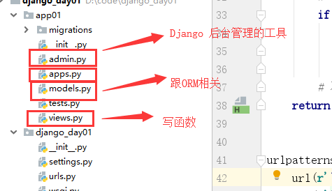

# 内容回顾

### 1.http协议

请求方式 8种 get post head put delete options trace connect

状态码

1xx 

2xx  200 ok 成功 

3xx  重定向  

4xx  请求的错误   404    403   402 

5xx   服务器的错误  500 

url

https://www.baidu.com/s?wd=grid&rsv_spt=1

请求（request  浏览器给服务器发送的消息）

“请求方式 URL路径 HTTP/1.1\r\n

k1:v1\r\n

k2:v2\r\n

\r\n

请求数据（请求体）”     ——》   get没有请求数据

响应（response  服务器返回给浏览器的信息）

“HTTP/1.1 状态码 状态描述\r\n

k1:v1\r\n

k2:v2\r\n

\r\n

响应数据（响应体）”        ——》 HTML文本

### 2.浏览器发送请求和接受响应的过程

1. 在浏览器上的地址栏种输入URL，回车，发送get请求；
2. 服务器接收到请求，获取URL的路径，根据路径做不同的操作，把返回的数据封装到响应体中，返回给浏览器
3. 浏览器接受到响应，双方断开连接
4. 浏览器从响应体种获取数据，进行解析渲染。

### 3.web框架

本质：socket服务端

功能：

1. socket收发消息    wsgi   wsgiref   uWSGI
2. 根据不同的路径返回不同的内容
3. 动态页面（字符串的替换  ——》 模板的渲染）  jinja2

django 2 3 

flask 2 

tornado 1 2 3 

### 4.django

#### 下载

1.命令行：

pip install django==1.11.21 -i https://pypi.tuna.tsinghua.edu.cn/simple

#### 创建项目

1.命令行

django-admin startproject  项目名称

2.pycharm

#### 启动

1.命令行

cd 项目的根目录   ——》 manage.py

python manage.py runserver  # 127.0.0.1:8000

python manage.py runserver  80  # 127.0.0.1:80

python manage.py runserver  0.0.0.0:80 # 0.0.0.0:80

2.pycharm

# 今日内容

### 1.静态文件的配置和使用

1.静态文件的配置和使用

settings.py

```python
STATIC_URL = '/static/'   # 别名
STATICFILES_DIRS = [
    os.path.join(BASE_DIR, 'static1'),
    os.path.join(BASE_DIR, 'static'),
    os.path.join(BASE_DIR, 'static2'),
]
```

```html
<link rel="stylesheet" href="/static/css/login.css">   # 别名开头
```

按照STATICFILES_DIRS列表的顺序进行查找。

### 2.简单的登录的实例

form表单提交数据注意的问题：

1. 提交的地址action=""  请求的方式 method="post"
2.  所有的input框有name属性
3. 有一个input框的type="submit" 或者 有一个button

提交POST请求，把settings中MIDDLEWARE的'django.middleware.csrf.CsrfViewMiddleware'注释掉

### 3.app



创建APP

命令行

python manage.py startapp app名称

pycharm工具

tools  ——》  run manage.py task  ——》  startapp  app名称

注册APP

```python 
INSTALLED_APPS = [
	...
    'app01',
    'app01.apps.App01Config',  # 推荐写法
]
```

### 4.ORM

#### Django中使用MySQL数据库的流程

1.创建一个MySQL数据库。

2.在settings中配置，Django连接MySQL数据库：

```python
DATABASES = {
    'default': {
        'ENGINE': 'django.db.backends.mysql',    # 引擎	
        'NAME': 'day53',						# 数据库名称
        'HOST': '127.0.0.1',					# ip地址
        'PORT':3306,							# 端口
        'USER':'root',							# 用户
        'PASSWORD':'123'						# 密码
        
    }
}
```

3.在与settings同级目录下的 init文件中写：

```python
import pymysql
pymysql.install_as_MySQLdb()
```

4.创建表（在app下的models.py中写类）:

```python
from django.db import models

class User(models.Model):
    username = models.CharField(max_length=32)   # username varchar(32)
    password = models.CharField(max_length=32)   # username varchar(32)
```

5.执行数据库迁移的命令

python manage.py makemigrations   #  检测每个注册app下的model.py   记录model的变更记录

python manage.py migrate   #  同步变更记录到数据库中

#### orm操作

```python
# 获取表中所有的数据
ret = models.User.objects.all()  # QuerySet 对象列表  【对象】
# 获取一个对象（有且唯一）
obj = models.User.objects.get(username='alex')   # 获取不到或者获取到多个对象会报错
# 获取满足条件的对象
ret = models.User.objects.filter(username='alex1',password='dasb')  # QuerySet 对象列表
```