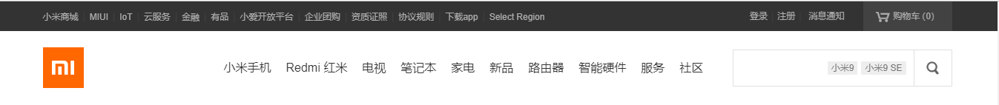

[TOC]

## 内容回顾

### 1.div和span标签在网页中的作用

div:将网站分割成独立的逻辑区域  division 分割

span: 小区域标签,在不影响文本正常显示的情况下，单独设置对应的样式

```html
<style>
    span.active{
        font-weight:bold;
    }
</style>
<p>
    <span class='active'>央视网消息</span>（新闻联播）：中共中央总书记、国家主席习近平28日上午在北京人民大会堂亲切会见出席第九届世界华侨华人社团联谊大会和中华海外联谊会五届一次理事大会的全体代表，代表党中央、国务院向大家表示热烈欢迎和衷心祝贺，向世界各地华侨华人致以诚挚问候。
</p>
```

### 2.css基础选择器和高级选择器有哪些？

选择器的作用：选中标签

#### 基础选择器

- id选择器 特定属性的元素（标签）
- 类选择器 class = 'active'   .active 类是可以重复，并且可以设置多个
- 标签选择器

#### 高级选择器

- 后代    子子孙孙
- 子代   只包括儿子
- 组合  html,body,div,p,ul....
- 交集 span.active


### 3.盒子模型的属性有哪些？并说明属性的含义，画出盒子模型图

```
width:内容的宽度
height:内容的高度
border:边框
padding:内边距
margin: 外边距
```


### 4.如何让文本垂直和水平居中？

```html
<style>
    div{
        width:200px;
        height: 60px;
        background-color: red;
        text-align:center;
        line-height: 60px;
    }
</style>
<div>
 wusir
</div>
```

让行高等于盒模型的高度实现垂直居中

使用text-align:center；实现文本水平居中


### 5.如何清除a标签的下划线？

```css
text-decoration: none;

none;无线
underline:下划线
overline:上划线
line-through:删除线
```

### 6.如何重置网页样式？

reset.css

```css
html,body,p,ul,ol{
    margin: 0;
    padding: 0;
}
/*通配符选择器 */
*{
    margin: 0;
    padding: 0;
}
a{
    text-decoration: none;
}
input,textarea{
    border: none;
    outline: none;
}
```


### 7.如何清除input和textarea标签的默认边框和外线？

### 8.在css中哪些属性是可以继承下来的？

```
color,text-xxx,font-xxx,line-height,letter-spacing,word-spacing
```


### 9.如何正确比较css中的权重？


```
如果选中了标签
	数选择器的数量  id  class 标签 谁大优先级越高 如果一样大，后面优先级越大
    如果没有选中标签，当前属性是被继承下来，他们的权重为0，与选中的标签没有可比性
    都是继承来的，谁描述的近，就显示谁的属性（就近（选中的标签越近）原则），如果描述的一样近，继续数选择器的数量。
    !important 它设置当前属性的权重为无限大，大不过行内样式的优先级
    

```


### 10.块级标签和行内标签

#### 块级标签

```
1.可以设置高度，如果不设置宽度，默认是父标签的100%的宽度
2.独占一行

p
div
ul
ol
li
h1~h6
table
tr
form
```

#### 行内标签

```
1.不可以设置宽高
2.在一行内显示
a 
span
b
strong
em
i
```

#### 行内块标签

```
1.可以设置宽高
2.在一行内显示

input
img
```


## 今日内容

### 伪类选择器

对于a标签，如果想设置a标签的样式，要作用于a标签上，对于继承性来说，a标签不起作用的

“爱恨准则”

LoVe HAte

```css
/*LoVe HAte*/
/*a标签没有被访问时候设置的属性*/
a:link{
    /*color: red;*/
}
/*a标签被访问时候设置的属性*/
a:visited{
    color:yellow;
}
/*a标签悬浮时设置的属性*/
a:hover{
    color: deeppink;
}
/*a标签被摁住的时候设置的属性*/
a:active{
    color: deepskyblue;
}
```


### 属性选择器

```css
input[type='text']{
    background-color: red;
}
input[type='checkbox']{

}
input[type='submit']{

}
```


### 伪元素选择器

```css
p::first-letter{
    color: red;
    font-size: 20px;
    font-weight: bold;
}
p::before{
    content:'@';
}
/*解决浮动布局常用的一种方法*/
p::after{
    /*通过伪元素添加的内容为行内元素*/
    content:'$';
}
```

### 常用格式化排版

#### 1.字体属性

#### 2.文本属性

参考：<https://book.apeland.cn/details/351/>

### 盒子模型

margin:在水平方向上不会出现问题，垂直方向上会出现塌陷问题

#### 布局-浮动

先参考一下：<https://book.apeland.cn/details/355/>

明天再详细讲浮动

## 今日作业：

