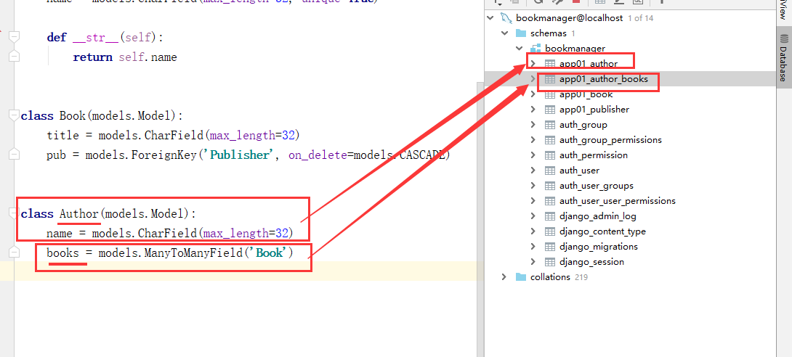

## 内容回顾

### 1.django处理请求的流程

1.浏览器的地址栏上输入地址，发送get请求

2.wsgi接受到请求

3.根据url的路径找到对应的函数

4.执行函数，返回响应。响应返回给wsgi，wsgi按照HTTP响应格式返回给浏览器

### 2.发请求的途径：

1.地址栏中输入地址  ——》  get

2.a标签    ——》 get

3.form表单    ——》 get/post

### 3.orm 

对应关系

类    ——》   数据表

对象  ——》  数据行（记录）

属性  ——》  字段

#### django使用MySQL数据库的流程：

1.创建一个MySQL数据库

2.配置

​	ENGINE   mysql

​	NAME   数据库名称

​	HOST   IP 

​	PORT 3306

​	USER   用户名

​	PASSWORD 密码

3.告诉django使用pymysql连接数据库

在与settings同级的init文件夹中写：

import pymysql

pymysql.install_as_MySQdb()

4.写表   在app下的models.py中写类

```python
class Book(models.Model):
    name = models.CharField(max_length=32)
    pub = models.ForeignKey('Publisher',on_delete=models.CASECADE)

```

5.执行数据库迁移的命令

python manage.py  makemigrations   # 记录models.py的变更记录

python  manage.py migrate  # 将变更记录同步到数据库中

#### 增删改查

增

```python
book_obj = Book.objects.create(name='xxx',pub=出版社对象)
book_obj = Book.objects.create(name='xxx',pub_id=出版社对象的id)
book_obj = Book(name='xxx',pub=出版社对象)
book_obj.save()  
```

查

```python
# 查询所有的对象
Book.objects.all()  #   ——》  queryset  对象列表
# 查询一个对象
book_obj = Book.objects.get(name='xxx')    # ——》 对象（有且唯一）   查不到或者多个就报错
# 查询满足条件的所有的对象
Book.objects.filter(name='xxx')  #  ——》  queryset  对象列表

book_obj.id    book_obj.pk  
book_obj.name  
book_obj.pub  #  ——》 出版社对象 
book_obj.pub.pk 
book_obj.pub_id
```

删

```python
book_obj.delete()
Book.objects.filter(pk=1).delete()
```

改

```python
book_obj.name='xxxxx'
book_obj.pub = 出版社对象
book_obj.pub_id = 出版社的id
book_obj.save()   # ——》 保存到数据库中
```

### 4.模板的语法

```python
render(request,'模板的文件名'，{'xxxx':'v1'})
{{ xxxx }}

for循环

	{{ forloop.counter }}
	{{ i }}


if判断


	xxx

    xxx

	xxxxx

```

### 5.函数

#### request

request.method    ——  》  请求方式 GET POST 

request.GET     ——》 url上的参数   ?name=xxx&age=18   {}      []   .get

request.POST  ——》 from表单提交POST请求的数据   

#### 响应

HTTPResponse（'字符串'）    ——》 字符串

render(request,'模板的文件名', {})    ——》  返回一个完整的页面

redirect('重定向的地址')    ——》    本质  Location：地址

## 今日内容

作者的管理  

### 1.设计表结构

出版社   书籍    作者 



```python
for author in all_authors:
    print(author)
    print(author.pk)
    print(author.name)
    print(author.books,type(author.books)) # 关系管理对象
    print(author.books.all(),type(author.books.all()))
    print('*'*30)
```

### 2.展示

设计url

```
url(r'^author_list/', views.author_list),
```

写函数

```python
# 展示作者
def author_list(request):
    # 查询所有的作者
    all_authors = models.Author.objects.all()
    return render(request,'author_list.html',{'all_authors':all_authors})
```

写模板

```HTML

    <tr>
        <td>{{ forloop.counter }}</td>
        <td>{{ author.pk }}</td>
        <td>{{ author.name }}</td>
        <td>
            

                
                    《{{ book.title }}》
                
                    《{{ book.title }}》、
                

            
        </td>

    </tr>

```

### 3.增加

```python
author_obj = models.Author.objects.create(name=author_name) # 只插入book表中的内容
author_obj.books.set(books)  # 设置作者和书籍多对多的关系
```

### 4.修改

```python
books = request.POST.getlist('books')

# 修改对象的数据
author_obj.name = name
author_obj.save()
# 多对多的关系
author_obj.books.set(books)  #  每次重新设置
```

### 5.django设置多对多关系三种方法

1.django帮我们生成第三张表

```
class Author(models.Model):
    name = models.CharField(max_length=32)
    books = models.ManyToManyField('Book')  # 不在Author表中生产字段，生产第三张表
```

2.自己创建第三张表

```python
class AuthorBook(models.Model):
    author = models.ForeignKey(Author, on_delete=models.CASCADE)
    book = models.ForeignKey(Book, on_delete=models.CASCADE)
    date = models.DateField()
```

3.自建的表和 ManyToManyField 联合使用

```python
class Author(models.Model):
    name = models.CharField(max_length=32)
    books = models.ManyToManyField('Book',through='AuthorBook')  # 不在Author表中生产字段，生产第三张表


class AuthorBook(models.Model):
    author = models.ForeignKey(Author, on_delete=models.CASCADE)
    book = models.ForeignKey(Book, on_delete=models.CASCADE)
    date = models.DateField()
```