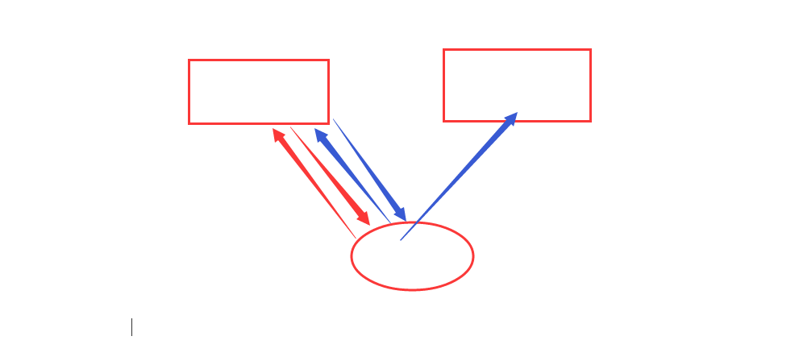

## 内容回顾

### 1.MVC和MTV

MVC

- M  model  和数据库打交道  
- V    view  视图 HTML
- C  controller  控制器   调度  传递指令

MTV 

- M model ORM 
- T   template  模板  HTML
- V  view  视图  函数  业务逻辑

### 2.变量

render(request,'模板的文件名'，{k1:v1;k2:v2})

{{  k1 }}    {{ request }}

{{  list.索引 }}   ——正向索引

{{  dic.key   }}

{{  dic.keys   }}

{{  dic.values}}

{{  dic.items }}

{{  pub.name  }}

{{  pub.talk  }}

优先级    字典中的key  >  对象的属性或者方法  > 索引

### 3.过滤器

修改变量的显示结果

{{  value|过滤器名称  }}    {{  value|过滤器名称:参数  }}

#### 内置的过滤器

default   变量不存在或者值为空使用默认值

add  +  数字相加   字符串的拼接  列表的拼接

slice 切片    {{ v|slice:'1:3:2' }}

length  取长度   len

lower  upper title center  ljust  rjust

truncatechars   按照字符进行截断    ...也计数在内

truncatewords  按照单词进行截断   只针对英文单词

join   使用字符串连接列表  

filesizeformat  文件大小   人性化  byte  PB

first  取第一个   

last  取最后一个

date 日期时间格式化  {{  now|date:"Y-m-d H:i:s"  }}

​	配置 DATETIME_FORMAT = 'Y-m-d H:i:s'     USE_L10N = False 

```
DATE_FORMAT = 'Y-m-d'
TIME_FORMAT = 'H:i:s'
```

safe    取消转义  xss攻击

### 4.自定义过滤器

1. 在app下创建一个名为templatetags的python包

2. 在python包下创建py文件  —— my_tags.py

3. 在py文件中写固定的内容

   ```python
   from django import template
   
   register = template.Library()
   ```

4. 写函数 + 装饰器

   ```python
   @register.filter
   def add_xx(value,arg=None):
       renturn '{}_{}'.format(value,arg)
       
       
   @register.filter(name='add_sb')
   def add_xx(value,arg=None):
       renturn '{}_{}'.format(value,arg)
   ```

使用：

```html

{{ 变量|add_xx:'xx'  }}

{{ 'alex'|add_sb:'sb' }}
```

## 今日内容

### for if

for 

forloop

for ... empty

```html

    <tr>
		.....
    </tr>

    <td colspan="5" style="text-align: center">没有相关的数据</td>


```

连续判断

python  10>5>1  =》   10>5  and 5>1   true 

js     10>5>1  =》   10>5  =》 true   =》   1>1  false

模板中  不支持连续连续判断  也不支持算数运算（过滤器）

### csrf_token

csrf    跨站请求伪造




### 母版和继承

母版	

就是一个普通HTML提取多个页面的公共部分 定义block块

继承：

1. 
2. 重写block块   —— 写子页面独特的内容

注意的点：

1.  写在第一行   前面不要有内容 有内容会显示

2.   'base.html' 加上引号   不然当做变量去查找
3. 把要显示的内容写在block块中
4. 定义多个block块，定义 css  js 块

### 组件

一小段HTML代码段   ——》 nav.html 



### 静态文件

```pyhton


 <link rel="stylesheet" href="">
 <link rel="stylesheet" href="">

  
   ——》 获取别名
```

### simpletag

```python
@register.simple_tag
def join_str(*args, **kwargs):
    return '{} - {} '.format('*'.join(args), '$'.join(kwargs.values()))
```

使用

```html


```

### inclusion_tag 

 返回HTML代码段


 


