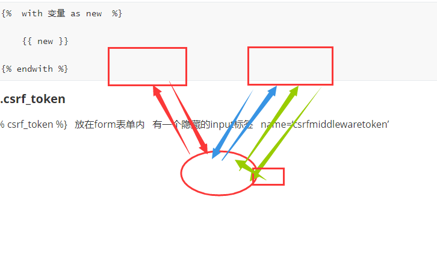
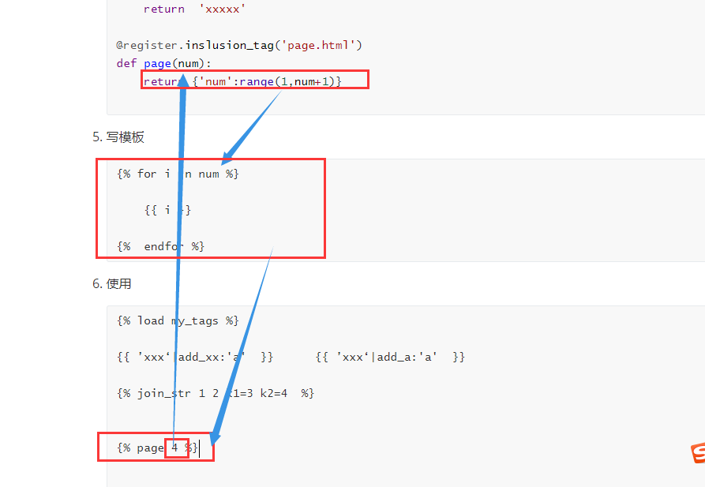

## 内容回顾

### 1.for

```html

	{{ i }} 
	{{ forloop }}

```

forloop

counter   从1开始

counter0   从0开始

revcounter  到1结束

revcounter0  到0结束

first   last  布尔值

parentloop    {}

```html

	{{ i }} 
	{{ forloop }}

   空空如也

```

### 2.if

```httml






	


```

注意点：不支持连续判断  不支持算数运算  10>5>1   10 > 5 > 1  

### 3.with

```html


	{{ new }}


```

### 4.csrf_token

   放在form表单内   有一个隐藏的input标签   name=‘csrfmiddlewaretoken’  



### 5.母版和继承

母版：

​		就是一个HTML页面，提取到多个页面的公共部分，页面中定义多个block块

继承：

		1.    
  		2. 重写block块

注意点：

	1.   写在第一行   上面不要有内容
 	2.   ‘base.html’ 加上引号   不然会当做是变量
 	3. 想显示的内容放在block块中
 	4. 多定义些block块  css   js 

### 6.组件

组件  一小段HTML代码段  nav.html 

使用：



### 7.静态文件



   

      ——》   STATIC_URL  

### 8.自定义方法

filter   simple_tag    inclusion_tag 

1. 在已注册的APP下创建templatetags的python包；

2. 在包内创建python文件  ——》  my_tags.py

3. 在py文件中写固定的内容：

   ```python 
   from django import template
   register = template.Library()
   ```

4. 写函数 + 装饰器

   ```python
   @register.filter(name='add_a')
   def add_xx(value,arg):
       return 'addd_xx'
   
   @register.simple_tag
   def join_str(*args,**kwargs):
       return  'xxxxx'
   
   @register.inslusion_tag('page.html')
   def page(num):
       return {'num':range(1,num+1)}
   
   ```

5. 写模板

   ```html
   
   	
   	{{ i }}
   
   
   ```

6. 使用

   ```html
   
   
   {{ ’xxx‘|add_xx:'a'  }}      {{ ’xxx‘|add_a:'a'  }}  
   
   
   
   
   
   
   
   ```

   


## 今日内容

### 1.CBV和FBV

FBV   function based  view    

CBV   class based  biew

定义CBV：

```python
from django.views import View

class AddPublisher(View):
    
    def get(self,request):
        """处理get请求"""
        return response
    
    
    def post(self,request):
        """处理post请求"""
        return response
```

  使用CBV：

```python
url(r'^add_publisher/', views.AddPublisher.as_view()),
```

### 2.as_view的流程

1.项目启动 加载ur.py时，执行类.as_view()    ——》  view函数

2.请求到来的时候执行view函数：

 1. 实例化类  ——》 self 

    ​	self.request = request 

	2. 执行seld.dispatch(request, *args, **kwargs)

    	1. 判断请求方式是否被允许：

        	1. 允许    通过反射获取到对应请求方式的方法   ——》 handler
        	2. 不允许   self.http_method_not_allowed  ——》handler

    	2. 执行handler（request，*args,**kwargs）

        返回响应   —— 》 浏览器

### 3.视图加装饰器

FBV  直接加装饰器

CBV 

```
from django.utils.decorators import method_decorator
```

1.加在方法上

```python
@method_decorator(timer)
def get(self, request, *args, **kwargs):
    """处理get请求"""
```

2.加在dispatch方法上

```python
@method_decorator(timer)
def dispatch(self, request, *args, **kwargs):
    # print('before')
    ret = super().dispatch(request, *args, **kwargs)
    # print('after')
    return ret


@method_decorator(timer,name='dispatch')
class AddPublisher(View):

```

3.加在类上

```python
@method_decorator(timer,name='post')
@method_decorator(timer,name='get')
class AddPublisher(View):
```

区别：

不适用method_decorator

func   ——》 <function AddPublisher.get at 0x000001FC8C358598>

args  ——》 (<app01.views.AddPublisher object at 0x000001FC8C432C50>, <WSGIRequest: GET '/add_publisher/'>)


使用method_decorator之后：

func ——》 <function method_decorator.<locals>._dec.<locals>._wrapper.<locals>.bound_func at 0x0000015185F7C0D0>

args ——》 (<WSGIRequest: GET '/add_publisher/'>,)


### 4.request对象 

```python
# 属性
request.methot   请求方式  GET
request.GET    url上携带的参数
request.POST   POST请求提交的数据
request.path_info   URL的路径    不包含ip和端口  不包含参数
request.body    请求体  b''
request.FILES   上传的文件
request.META    请求头 

request.COOKIES  cookie
request.session	 session

# 方法
request.get_full_path()   URL的路径   不包含ip和端口 包含参数
request.is_ajax()    判断是都是ajax请求
```

### 5.response对象

```python
from django.shortcuts import render, redirect, HttpResponse
HttpResponse('字符串')    ——》  ’字符创‘
render(request,'模板的文件名',{k1:v1})   ——》 返回一个完整的TML页面
redirect('重定向的地址')    ——》 重定向   Location ： 地址

from django.http.response import JsonResponse
JsonResponse({})
JsonResponse([],safe=False)
```

